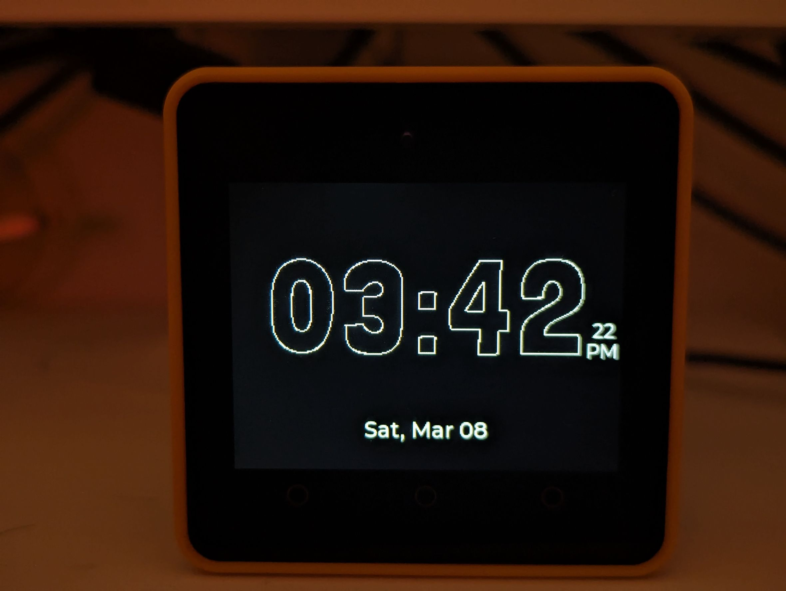

# M5Stack NTP Clock



A minimalist digital clock for M5Stack Core2 featuring NTP synchronization and a clean, elegant display. Shows time, date, and day of week with precision and style.

## Key Features

- Minimalist UI with 12-hour time format and seconds display
- One-touch time synchronization via WiFi (hold center button for 5s)
- Battery-efficient design (WiFi only active during sync)
- RTC-backed timekeeping for accuracy when offline

## Hardware

- [M5Stack Core2](https://shop.m5stack.com/products/m5stack-core2-esp32-iot-development-kit)

## Quick Setup

1. **Clone & Configure:**
   ```
   git clone https://github.com/yourusername/M5stack_Clock.git
   cp src/secrets.h.template src/secrets.h
   ```

2. **Edit WiFi credentials** in `src/secrets.h`

3. **Build & Upload** using PlatformIO

## Usage

- **View time:** The clock displays automatically on power-up
- **Sync time:** Hold middle button (B) for 5 seconds
- **Time zone:** Currently set to GMT+7 (Bangkok)
  - To change: Modify `gmtOffset_sec` in `main.cpp`

## Fonts Used

- [**BlackHanSans-Regular**](https://fonts.google.com/specimen/Black+Han+Sans)


## Tech Stack

Built with M5Core2 library, LVGL 8.3.6, and ESP32 Arduino framework.

---
